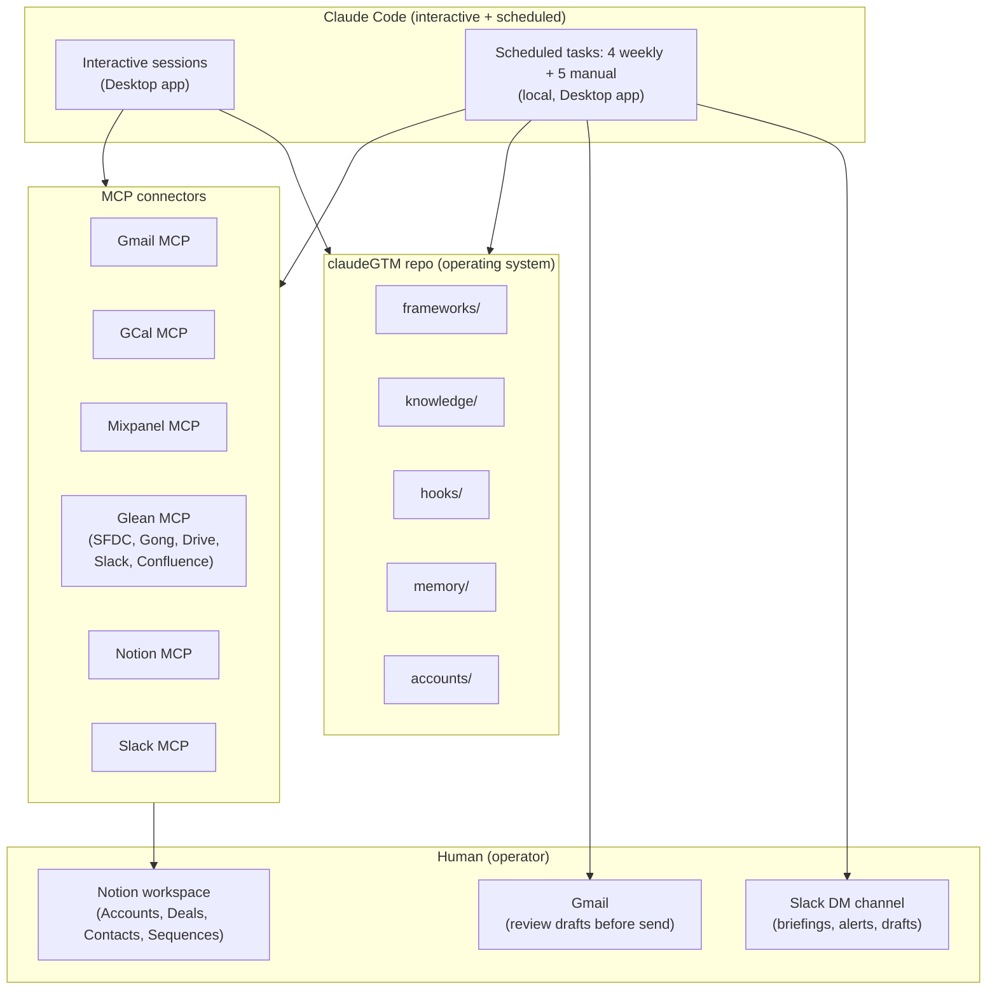
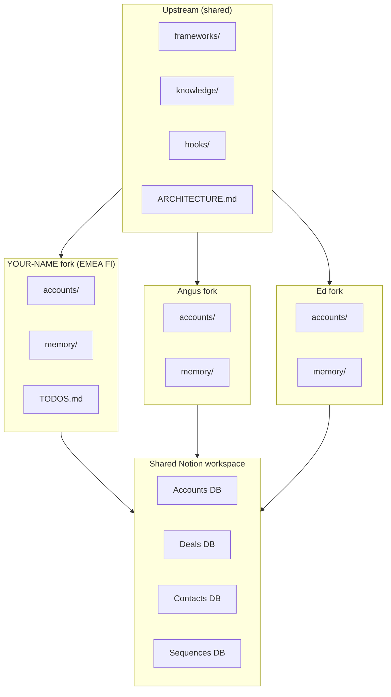

# Architecture

This document explains how claudeGTM works and why it's built this way.

## The Core Idea

claudeGTM gives Claude persistent memory, opinionated frameworks, and enforcement hooks for GTM account management. Without it, every session starts from zero. With it, Claude picks up where it left off, follows the same playbook, and can't skip the important steps.

The key insight: an AI assistant doing GTM work needs **persistent context** (what happened last session, pipeline state, open actions) and **enforced discipline** (research before outreach, read the framework before drafting, update context after every session). Persistence is solved by the repo. Discipline is solved by hooks.

> **For a visual, share-friendly version of this document** — see the Notion mirror at `claudeGTM — System Architecture & Pod Rollout Model` (linked from `EMEA FI Account Management`). It carries the same content with mermaid diagrams rendered.

## System at a Glance



## System Flow

```
Session Start
─────────────
  1. Mount ~/claudeGTM as workspace folder
  2. Read .claude/CLAUDE.md (instructions load automatically)
  3. Run preamble: read memory/active-context.md
  4. Check for stale pipeline data, overdue actions
  5. Resume work with full context

During Session
──────────────
  Before outreach  → Read frameworks/outreach.md + research externally
  Before business case → Read frameworks/business-case.md
  Before champion doc → Read frameworks/champion-doc.md
  After a call → Read frameworks/call-debrief.md → debrief → follow-up
  Handling objection → Read frameworks/objections.md
  Expansion signal → Read frameworks/expansion.md
  Any content → Run quality check against frameworks/document-quality.md

Session End
───────────
  1. Update memory/active-context.md (roll sessions forward)
  2. Log any new objections, expansion signals, pipeline changes
  3. "Commit the updates" → git add, commit, push
```

## File Roles

| File | Role | When It's Read |
|------|------|----------------|
| `.claude/CLAUDE.md` | Core instructions — who you are, how to work, enforcement rules | Auto-loaded every session |
| `ETHOS.md` | Operating philosophy — research first, warm first, consultant tone | Referenced by CLAUDE.md |
| `memory/active-context.md` | Session continuity — what happened, pipeline state, open actions | Session start (preamble) |
| `memory/analytics.jsonl` | Framework usage tracking — which frameworks get used, when | Appended during session |
| `frameworks/*.md` | GTM playbooks — outreach, business case, champion doc, etc. | Before generating content |
| `hooks/check-quality.sh` | Document quality enforcement — banned words, structure rules | Before sending any content |
| `hooks/check-research.sh` | Research enforcement — blocks outreach without prior research | Before drafting outreach |
| `TODOS.md` | Unified backlog — pipeline actions, framework improvements | Session start, weekly retro |

## Enforcement Model

### Soft Hooks (CLAUDE.md Instructions)

These are enforced by Claude reading and following the instructions in CLAUDE.md. They work in every Claude environment (Cowork, Claude Code, API).

- **Preamble**: Read active-context.md at session start
- **Framework reading**: Read the relevant framework file before generating content
- **Research before outreach**: Search externally before drafting
- **Document quality**: Apply anti-slop rules to all content
- **Session continuity**: Update active-context.md at session end

### Hard Hooks (Shell Scripts)

Shell scripts in `hooks/`. As of v0.6.0 three are wired directly into Claude Code's hook system via `.claude/settings.json` — they run automatically, not by convention:

- `session-start.sh` — **SessionStart hook.** Preamble digest into context at every session start: config check, MCP staleness, git state, handoff-gap detection (catches silent scheduled-task failure), account-file freshness, P0 count + backlog age.
- `session-end.sh` — **SessionEnd hook.** Appends an `unclean_session_end` marker to handoff.jsonl when a session terminates with uncommitted work, so the next session's digest surfaces what was stranded.
- `check-outbound-quality.sh` — **PreToolUse hook on `*create_draft*` tools.** Extracts draft text from the tool call, runs `check-quality.sh`, blocks the call (exit 2) on violations — banned language cannot reach a Gmail draft.

The rest run by protocol (invoked by the preamble, frameworks, or on demand):

- `check-config.sh` — Validates MY-CONFIG.md exists and is complete
- `check-mcp.sh` — Reports MCP probe health from `memory/mcp-status.json`; exits 1 on broken or stale (>24h)
- `check-framework.sh` — Maps a task type to the framework files that must be read first
- `check-quality.sh` — Scans generated content for banned language and patterns (also the engine behind the PreToolUse gate)
- `check-research.sh` — Verifies research was logged before outreach generation
- `next-session-id.sh` — Mints session IDs (max existing + 1; counting events caused the S-028 collision)
- `git-safe.sh` / `reap-git-locks.sh` — git serialization + host-side lock reaping (see Infrastructure Postmortems)

### Analytics

Framework usage is logged to `memory/analytics.jsonl` in append-only JSONL format:

```json
{"framework":"outreach","account":"Account_A","ts":"2026-03-25T10:00:00Z","action":"draft_email"}
{"framework":"call-debrief","account":"Account_B","ts":"2026-03-25T14:00:00Z","action":"post_call"}
```

This enables weekly retros to show: which frameworks are being used, which accounts are getting attention, where there are gaps.

## Session Continuity Model

```
Session N-2          Session N-1          Session N (now)
───────────         ───────────         ──────────────
"Two Sessions Ago"  "Previous Session"  "This Session"
                    ← rolled forward ←  ← current work

At session end:
  "Two Sessions Ago" = old "Previous Session" (or deleted if >3 sessions back)
  "Previous Session" = old "This Session"
  "This Session" = cleared for next session
```

Three-session lookback. Anything older gets deleted. This keeps context fresh without unbounded growth.

## Completion Status Protocol

Every GTM workflow reports status using one of:

- **DONE** — All steps completed. Evidence provided.
- **DONE_WITH_CONCERNS** — Completed, but with flags. List each concern.
- **BLOCKED** — Cannot proceed. State what's blocking and what was tried.
- **NEEDS_CONTEXT** — Missing information. State exactly what's needed.

### Escalation

It is always OK to say "I don't have enough information to do this well."

Bad outreach is worse than no outreach. Bad research is worse than no research.
- If research is insufficient after 3 search attempts, STOP and flag what's missing.
- If an account has no warm path and cold outreach feels forced, flag it.
- If the ask doesn't match the relationship stage, flag it.

```
STATUS: BLOCKED | NEEDS_CONTEXT
REASON: [1-2 sentences]
ATTEMPTED: [what was tried]
RECOMMENDATION: [what should happen next]
```

## Connector Layer

The system uses native MCP connectors for all data access. Chrome and Gemini CLI are retained only for edge cases.

```
Native MCPs (primary):
├── Gmail MCP         → email search, read, draft creation
├── GCal MCP          → calendar events, scheduling, availability
├── Mixpanel MCP      → product usage queries (project [YOUR_PROJECT_ID], $account property)
├── Glean MCP         → cross-source search (Gong, SFDC, Slack, Drive, Confluence, Gmail, Notion, Jira)
├── Slack MCP         → message posting, channel access
├── Notion MCP        → database read/write (Accounts, Deals, Contacts, Sequences)
└── Atlassian MCP     → Jira/Confluence read/write

Retained (edge cases only):
└── Gemini CLI        → Google Docs creation, large-context repo analysis (2M tokens)

Eliminated:
├── Chrome MCP        → Replaced by Glean (SFDC for deal data, Gong for transcripts)
└── Gemini CLI (Gmail/Calendar) → Replaced by Gmail MCP + GCal MCP
```

## Scheduled Automation Layer

Scheduled tasks run as Local tasks in the Claude Code Desktop app, reading from and writing to the same files the interactive system uses. All outputs post to Slack DMs.

**Current state (verified 2026-06-10):** 4 enabled on a weekly cadence — briefing Mon ~10:23, staleness check Wed ~10:01, Mixpanel sync Wed ~13:06, retro Fri ~11:08. The other 5 are manual-only. The per-task listing below documents the original daily defaults, kept for anyone re-enabling them.

```
Monday–Friday 8:00 AM     →  mixpanel-usage-sync
                              Uses: Mixpanel MCP (Run-Query per account)
                              Calculates: Health Score (0-100) and Churn Risk classification
                              Updates: Notion Accounts (usage status, 30d events, trend, health score, churn risk)
                              Posts: Usage + health summary to Slack (alerts on Critical/High churn risk)

Monday–Friday 9:00 AM     →  daily-gtm-briefing
                              Uses: GCal MCP + Gmail MCP + Mixpanel MCP + Glean MCP + Notion MCP
                              Reads: active-context.md, TODOS.md, handoff.jsonl
                              Surfaces: Health Score alerts, renewal reminders, sequence activity
                              Posts: Morning intelligence briefing to Slack

Monday–Friday 9:00 AM     →  external-call-prep
                              Uses: GCal MCP + Mixpanel MCP + Glean MCP (SFDC/Gong/Drive/Notion/Jira)
                              Reads: active-context.md, accounts/, knowledge/
                              Produces: Stakeholder map, product intel from Notion PRDs, Jira feature status
                              Posts: Structured call prep per external meeting to Slack

Monday–Friday 9AM & 3PM   →  lead-response-scanner
                              Uses: Gmail MCP + Glean MCP (enrichment) + Notion MCP (dedup)
                              Dedup: Searches Notion Contacts by email+name before creating
                              Updates: Notion Contacts (create or update), Gmail drafts
                              Posts: Lead alerts to Slack (flags potential duplicates for review)

Monday–Friday 10:00 AM    →  outbound-sequence-engine
                              Uses: Notion MCP (Sequences DB) + Gmail MCP + Glean MCP
                              Reads: Active sequences with due Next Touch Date
                              Checks: Reply detection before sending next step
                              Drafts: Emails via gmail_create_draft (never auto-sends)
                              Updates: Sequence state (Current Step, Status, Next Touch Date)
                              Suggests: New sequence candidates (paused for approval)
                              Posts: Sequence activity summary to Slack

Monday–Friday 5:00 PM     →  gong-pipeline-sync (fully cloud-based)
                              Uses: Glean MCP (SFDC opps + contacts + Gong transcripts + Gmail)
                              Enriches: Notion Contacts from SFDC (dedup, create/update)
                              Tracks: Last Contacted per contact (Gmail + Gong), Last Touch per account
                              Produces: Multi-threading assessment, call recency, engagement gaps
                              Updates: Notion Deals + Contacts + Accounts, pipeline table
                              Posts: Sync summary + contact enrichment counts + engagement flags to Slack

Monday 10:00 AM           →  renewal-tracker
                              Uses: Notion MCP (Accounts + Sequences DBs) + Glean MCP (SFDC)
                              Scans: Renewal dates, categorizes urgency (Critical/Urgent/Active/Planning)
                              Triggers: Auto-creates Churn Intervention + Renewal Prep sequences
                              Generates: Renewal prep docs for upcoming renewals
                              Posts: Renewal reminders + urgency flags to Slack

Wednesday 10:00 AM        →  pipeline-staleness-check
                              Uses: Glean MCP (activity verification + SFDC contacts + Gong competitive)
                              Uses: Mixpanel MCP (usage check)
                              Produces: Multi-threading risk scan, competitive mention monitoring
                              Posts: Hygiene report to Slack (stale, single-threaded, competitive)

Friday 4:00 PM            →  weekly-gtm-retro
                              Uses: Mixpanel MCP (WoW trends) + Glean MCP (weekly synthesis)
                              Uses: Glean (SFDC contacts, Gong calls, Drive account plans)
                              Produces: Multi-threading trends, account plan freshness, competitive intel
                              Outputs: Full retro saved to memory/retros/retro-YYYY-MM-DD.md
                              Posts: Comprehensive retro to Slack
```

The active weekly chain: briefing Monday → staleness check Wednesday morning → Mixpanel sync + health scores Wednesday midday → retro Friday. The original daily chain (sync → briefing → call prep → sequences → Gong sync, each feeding the next) was retired ~May 2026 as more cadence than the workflow needed. Its dependency design still applies whenever those tasks run manually: usage data should be fresh before briefings, and Gong/pipeline sync should precede anything reading contact recency.

## Data Flow: Source Systems → Notion CRM

```
Source Systems (read-only via Glean)          Notion (persistent CRM layer)
─────────────────────────────────────         ──────────────────────────────
SFDC Contacts ──→ gong-pipeline-sync ──→ Notion Contacts DB
  (Name, Title, Email)   (dedup check)        (+ Type, Warmth, Source, Notes)

Gmail threads ──→ gong-pipeline-sync ──→ Contacts: Last Contacted
Gong calls    ──→                    ──→ Contacts: Last Contacted

Gmail + Gong + GCal ──→ gong-pipeline-sync ──→ Accounts: Last Touch
  (most recent of all touchpoints)

SFDC Opps ──→ gong-pipeline-sync ──→ Notion Deals DB
  (Stage, Amount, Close Date)         (+ Risk Flag, Next Step, Notes)

LeanData leads ──→ lead-response-scanner ──→ Notion Contacts DB
  (via Gmail)      (dedup before create)      (Source: Inbound Lead)

Mixpanel usage ──→ mixpanel-usage-sync ──→ Accounts: Health Score, Churn Risk
  (30d events, trend)  (4-component model)    (0-100 score, Critical/High/Med/Low)

Renewal dates ──→ renewal-tracker ──→ Notion Sequences DB
  (from Accounts DB)  (120d advance)    (auto-creates Renewal Prep + Churn Intervention)

Sequences DB ──→ outbound-sequence-engine ──→ Gmail Drafts
  (due steps)     (research + draft)          (never auto-sends)

Notion PRDs ──→ external-call-prep ──→ Slack (product intel in call prep)
Jira tickets ──→                   ──→ Slack (feature status in call prep)
```

SFDC is source of truth for: Name, Title, Email, Stage, Amount, Close Date.
Notion is source of truth for: Type, Warmth, Source, Notes, [YOUR_PRODUCT] Owner, Risk Flag, Next Step, Health Score, Churn Risk, Renewal Date.

### Health Score Model (0-100) — Three-Component Architecture

The Health Score is a **three-component composite** calculated daily by `mixpanel-usage-sync`. Each component is scored independently (0-100) and visible in Notion for diagnosis. The composite is a weighted average.

#### Component 1: Leading Score (35% of composite)
Predicts future health. If Leading drops while Lagging holds = early warning.

| Sub-metric | Points | Method |
|-----------|--------|--------|
| Feature breadth (distinct event types used / total available) | 25 | Ratio: 0-25 scaled linearly. 8/10 types = 20pts. |
| User growth (net new active users in 30d) | 25 | >2 new = 25, 1 new = 15, 0 = 5, negative = 0 |
| Session depth trend (weighted events per active user, EWMA) | 25 | EWMA(λ=0.3) vs 90d baseline. Z>0 = improving, Z<-1 = declining |
| Time-to-value for new users (days from provision to first high-value event) | 25 | <7d = 25, 7-14d = 20, 14-30d = 10, >30d or no new users = baseline |

#### Component 2: Lagging Score (45% of composite)
Confirms current state from observed usage data.

| Sub-metric | Points | Method |
|-----------|--------|--------|
| Weighted event volume (30d, value-weighted) | 30 | Events weighted by value tier (see Event Value Weights below). Scored relative to account's own EWMA baseline via z-score. Z>1 = 30, Z>0 = 22, Z>-1 = 15, Z>-2 = 8, Z<-2 = 0 |
| Active user count (non-deprovisioned users with >0 events in 30d) | 20 | Scaled by account size. >10 = 20, 5-10 = 15, 3-4 = 10, 1-2 = 5 |
| Concentration risk (% of events from top user) | 25 | <40% = 25, 40-60% = 15, 60-70% = 8, >70% = 0 |
| Usage trend (EWMA direction) | 25 | EWMA(λ=0.3) trend over 90d. Rising = 25, stable = 15, declining = 8, cliff (z<-2) = 0 |

#### Component 3: Context Score (20% of composite)
Qualitative and deal-level signals that usage data alone can't capture.

| Sub-metric | Points | Method |
|-----------|--------|--------|
| Renewal proximity | 25 | >180d = 25, 120-180d = 20, 60-120d = 15, 30-60d = 8, <30d = 3 |
| MEDDPICC completeness | 25 | Score 0-25 based on % of MEDDPICC elements filled in active deals |
| Deal stage progression (velocity) | 25 | Advanced stage in last 30d = 25, static = 12, regression = 0 |
| Competitive/qualitative signals | 25 | No competitor mentions + positive Gong sentiment = 25. Competitor POC = 0. Negative sentiment = 5. |

#### Composite Health Score
```
Composite = (Leading × 0.35) + (Lagging × 0.45) + (Context × 0.20)
```
Reported as a **band** (±8 confidence interval), e.g., "55-71" not "63". Sequence triggers fire only when the **entire band** is below threshold (conservative).

#### Event Value Weights
Not all events are equal. High-value actions that indicate real investigative work score higher:

| Tier | Events | Weight |
|------|--------|--------|
| **High-value** (investigation/output) | `add_to_graph`, `resolve`, `export`, `explore` | 3× |
| **Medium-value** (research/analysis) | `search`, `get_entity`, `get_entity_summary` | 1× |
| **Low-value** (navigation/presence) | `login`, `navigation`, `get_record` | 0.5× |

Weighted Event Count = Σ(event_count × weight). This replaces raw event count in all health calculations.

#### EWMA Trend Smoothing
Replace simple month-over-month comparison with Exponentially Weighted Moving Average:
```
EWMA_t = λ × current_value + (1-λ) × EWMA_(t-1)    where λ = 0.3
```
- Stored per account in Notion as "EWMA Baseline" field
- Comparison: today's weighted events vs EWMA baseline, measured as z-score against 90d rolling standard deviation
- Eliminates MoM cliff effects where a single busy/quiet week 31 days ago swings the trend

#### Z-Score Anomaly Detection
Per-account normalization using rolling 90-day statistics:
```
z = (current_30d_weighted_events - rolling_90d_mean) / rolling_90d_stddev
```
- z < -2: **Significant drop** — alert immediately (account-relative, not absolute)
- z > 2: **Significant spike** — investigate (could be genuine growth or data anomaly like Account_M 5.6x overcounting)
- -1 < z < 1: Normal variation, no alert

This means a 20% drop for Account_E (62K events) = noise (z≈-0.5), while the same 20% for Account_I (10K events) = critical (z≈-2.5).

#### Lifecycle-Adjusted Scoring
Accounts tagged with lifecycle stage in Notion: **Onboarding** (<6 months) / **Ramping** (6-12 months) / **Mature** (>12 months) / **Renewal** (within 120 days).

- **Onboarding accounts**: Scored primarily on Leading Score (adoption velocity, feature breadth growth, user provisioning rate). Low Lagging Score is expected and not penalized. Baseline comparison starts from their own first 30d, not mature account averages.
- **Mature accounts**: Full three-component scoring. All sub-metrics active.
- **Renewal accounts**: Context Score weighted higher (30% instead of 20%) — deal mechanics matter more near renewal.

#### Data Quality Checks (run before writing scores)
Three automated gates in `mixpanel-usage-sync` before any score is written to Notion:

1. **Overcounting detection**: If any account's weighted event count is >3× its 90-day EWMA, flag as potential data anomaly (Account_M-pattern). Write score as "UNDER REVIEW" instead of a number. Alert on Slack.
2. **Zombie user filter**: Exclude users where `$deprovisioned = true` from active user counts and concentration calculations.
3. **Pipeline break detection**: If a known customer account returns 0 events for 7+ consecutive days, flag as potential data pipeline issue (not necessarily churn). Alert separately from health alerts.

#### Churn Risk Classification
Uses the **lower bound** of the confidence band (conservative):

| Classification | Condition | Auto-Trigger |
|---------------|-----------|-------------|
| **CRITICAL** | Lower band < 30 AND renewal < 180d | Churn Intervention sequence (7d emergency cadence) |
| **HIGH** | Lower band 30-49 AND EWMA declining (z < -1) | Accelerated Renewal Prep + daily briefing alert |
| **MEDIUM** | Lower band 50-64 AND (declining OR renewal < 120d) | Standard Renewal Prep + weekly retro focus |
| **LOW** | Lower band 65+ AND stable/improving | Normal management cadence |
| **N/A** | Not a customer | No health tracking |
| **DATA FILE** | Data File product only (no Mixpanel visibility) | Context Score only — health from SFDC delivery, API logs, support, engagement |

#### Data File Account Health (Account_Q, Account_J, Account_N)
Mixpanel (Graph-Metrics) only tracks interactive UI usage. **Data File customers generate zero Mixpanel events** — they receive bulk data deliveries, not Graph access. This is NOT a bug; it's a product type mismatch.

For Data File accounts, health scoring relies on:
1. **Context Score only** (100% weight): Renewal proximity, MEDDPICC, deal stage, competitive signals, qualitative Gong/Gmail engagement
2. **SFDC delivery records** (via Glean): Confirm data deliveries are happening on schedule
3. **Engagement signals**: Last Touch (Gmail/Gong), support ticket activity, QBR participation
4. **API usage** (if applicable): If the account uses [YOUR_PRODUCT] API, check API call logs (not in Mixpanel)

Leading and Lagging Scores are set to N/A for pure Data File accounts. The Health Tier for Data File accounts should be clearly labeled "DATA FILE — Limited Visibility" to prevent false confidence from Context Score alone.

**Account-to-Product-Type mapping is stored in Notion Accounts DB (`Product Type` field).** The `mixpanel-usage-sync` task must check Product Type BEFORE querying Mixpanel — skip Mixpanel queries for Data File accounts and score them on Context only.

#### State-Change Alerting
Daily alerts fire **only when an account changes health tier** (e.g., WATCH → AT RISK). Stable-state accounts get a one-line summary in the daily briefing, not a full alert. This prevents alert fatigue.

Alert format (mandatory for all health alerts in Slack):
```
[Account] [OLD_TIER → NEW_TIER]: Score band [X-Y]
  What changed: [specific data point that drove the change]
  Why it matters: [context — renewal date, concentration, deal stage]
  Action: [specific recommended next step with timeframe]
```

#### Feedback Loop (measured weekly in retro)
Every weekly retro includes a "Health Score Accuracy Review":
1. Which accounts changed tier this week?
2. Were state changes validated by real-world outcomes?
3. Did interventions (Churn Intervention, multi-threading plays) change trajectory?
4. Log as `health_outcome` events in analytics.jsonl for long-term calibration.

After 60 days: correlation analysis to validate/adjust component weights (35/45/20).
After 90 days: threshold optimization using empirical score distributions and outcomes.

#### Phase 3 Improvements (Queued, Data-Dependent)
These activate automatically when sufficient historical data exists:
- **Weight validation** (60d): Correlate Leading/Lagging/Context scores with actual outcomes. Adjust 35/45/20 weights.
- **Threshold optimization** (90d): Replace 30/49/64 boundaries with data-driven cutoffs.
- **Seasonality baseline** (6+ months): Compare to same-period-prior-year, not just prior month.
- **API vs human separation**: Tag API-generated events separately. Score on human events only; report API usage as "integration depth."
- **Cross-BU attribution**: Explicit rules per account (e.g., Account_B-Complex + Account_B-Fraud = one health score, separate BU breakdowns available).
- **Surprise non-renewal detection**: If renewal date unknown + usage declining + no exec engagement in 60d → flag as "silent churn risk."

The scheduling layer is additive — it doesn't replace interactive sessions, it supplements them. Scheduled tasks can flag issues that interactive sessions then resolve.

## Task Coordination Model

Scheduled tasks run on independent cron schedules but have implicit data dependencies. The coordination model ensures downstream tasks know when upstream data is stale, retries handle transient MCP failures, and outputs aren't duplicated.

Full specification: `frameworks/task-coordination.md`.

### Dependency DAG

```
mixpanel-usage-sync ──→ daily-gtm-briefing     (needs fresh health scores)
mixpanel-usage-sync ──→ external-call-prep      (needs fresh usage for call context)
gong-pipeline-sync  ──→ renewal-tracker         (needs latest opp/contact data)
lead-response-scanner-am ──→ outbound-sequence-engine (new leads → new sequences)
```

Downstream tasks never skip due to upstream failure — they run with degraded confidence and flag it.

### Task Registry (`memory/task-registry.jsonl`)

Every task writes a completion record with status, data freshness date, and error details. Downstream tasks read this to determine data confidence before running.

### Resilience Patterns

- **Retry**: MCP call failure → wait 60s → retry → wait 120s → retry → fallback.
- **Fallback**: Use last-known-good data from Notion + flag as STALE.
- **Circuit breaker**: 3 consecutive runs with same MCP failure → escalation alert to Slack.
- **Checkpoint cleanup**: Stale task-state files (>48h) archived automatically.

### Observability

Tasks log structured trace events to `memory/analytics.jsonl`: `task_start`, `task_mcp_call` (with retry count), `task_fallback`, `task_complete` (with duration and metrics). The weekly retro includes a Task Health section synthesizing these events.

### Output Idempotency

Before creating external outputs (Gmail drafts, Notion records), tasks check `memory/handoff.jsonl` for matching pending records in the last 48 hours. If a matching unresolved output exists, the task skips creation and logs `already_pending`. Interactive sessions mark outputs as `resolved` when acted upon.

## Two-Layer Architecture

```
┌─────────────────────────────────────────────┐
│  Cowork Project (session infrastructure)    │
│  - Persistent folder binding                │
│  - Conversation memory across sessions      │
│  - Scheduled task execution                 │
│  - MCP connector access (Slack, Calendar…)  │
└─────────────────┬───────────────────────────┘
                  │ mounts
┌─────────────────▼───────────────────────────┐
│  claudeGTM repo (operating system)          │
│  - Frameworks (outreach, debrief, retro…)   │
│  - Enforcement hooks (quality, research)    │
│  - Analytics logging (JSONL)                │
│  - Context management (active-context.md)   │
│  - Version control (git)                    │
│  - Portability (clone anywhere)             │
└─────────────────────────────────────────────┘
```

Both layers required. Projects without the repo loses discipline. The repo without Projects loses convenience and automation.

## Pod & Cross-Team Rollout

The current implementation is single-user (one operator's GTM). The system is designed to fork.

### Today — single user

Frameworks, hooks, and infrastructure are general-purpose and forkable, but the live state (`accounts/`, `memory/`, `analytics.jsonl`, `TODOS.md`) is single-tenant.

### Pod model — same role, multiple reps

Each rep forks the repo. Shared frameworks/knowledge/hooks stay upstream. Personal context lives in the fork.



Update flow: any rep contributes a framework or knowledge improvement upstream via PR. All other forks pull it on next session start. Live pipeline state (Notion DBs) is shared; per-account memory and research stays in each fork.

### Cross-role — full GTM org

Every role runs on claudeGTM. One person's research becomes everyone's context. Roles map to distinct workflows over a shared substrate:

| Role | Frameworks active | Scheduled tasks active |
|------|-------------------|------------------------|
| **Account Management** | outreach, expansion, retro, multi-threading, sequences | full daily/weekly stack |
| **Customer Success** | onboarding, expansion, call-debrief, retro | mixpanel-usage-sync, renewal-tracker, weekly-retro |
| **Solutions Engineering** | objections, business-case, expert-panel | external-call-prep only |
| **Field Deployment** | onboarding, call-debrief | external-call-prep, pipeline-staleness-check |
| **Product Marketing** | competitive-intel, document-quality | weekly-retro |

When an AM updates a competitive battlecard, CS gets it. When an FDE logs a deployment issue, AM sees it in call prep. When SE captures a technical objection, the next deal benefits.

### Practical onboarding for a new role

1. Fork the repo + drop in role-specific frameworks alongside the shared ones.
2. Customize `.claude/MY-CONFIG.md` (identity, account list, service IDs).
3. Author role-specific knowledge files (e.g., `knowledge/onboarding-playbook.md` for CS, `knowledge/poc-patterns.md` for SE).
4. Subscribe to the shared Notion workspace.
5. Pick which scheduled tasks fit the role — disable the rest.

## Current Limitations

Honest assessment of where the system is brittle, manual, or single-tenant. A new fork will hit these on day one.

### Infrastructure

- **Local-only scheduled tasks.** All tasks (4 enabled + 5 manual-only) run via the Claude Code Desktop app on a Mac. Mac must be awake + Desktop app open. If the machine sleeps at the scheduled time, that run is skipped (no retry). Known failure mode (Jun 2026): a task can show fresh `lastRunAt` while producing zero output — `hooks/session-start.sh` detects this via handoff-gap staleness.
- **No Cloud routines.** Cloud-based project-scoped triggers cannot resolve MCP tools at runtime as of Apr 2026. Claude Code Routines were evaluated and rejected (research preview instability + unconfirmed MCP fix). Revisit when Routines hit GA.
- **MCP availability varies.** Some MCPs are intermittently unavailable (Mixpanel had multi-day outages in April 2026). The `check-mcp.sh` gate flags BROKEN MCPs but tasks that depend on them still fail until restored.
- **Cowork virtiofs unlink limitation.** Git index locks can strand from inside the Cowork sandbox — handled by an external host-side reaper LaunchAgent. Patch, not cure. See "Infrastructure Postmortems" below.

### State & sync

- **Notion is a mirror, not source-of-truth.** Repo files are canonical. Notion is updated by scheduled tasks + end-session protocol. Drift is possible if a sync step fails silently.
- **Knowledge sync is opportunistic.** The Notion Knowledge Base only updates when `domain-summary.md` or `communication-playbook.md` actually changed in a session. If those files are edited and the end-session protocol skipped, Notion stays stale.
- **Single-user CRM model.** The Notion Accounts/Deals/Contacts/Sequences DBs are shared across forks, but health scoring, sequence generation, and pipeline analysis assume one operator. Pod model needs per-rep ownership fields to scale.
- **No real-time multi-user collaboration.** Two reps editing the same account file in their forks at the same time will diverge until they `git pull` and merge.

### Data & integrations

- **No CRM write access.** Salesforce is read-only via Glean. Stage updates, activity logging, and field edits all happen in Notion (the editable mirror) or manually in SFDC. A native SFDC MCP would close this gap.
- **No Gong scoring.** Gong's proprietary deal scores, warnings, and engagement metrics aren't available via Glean. We have the underlying data (SFDC + transcripts) but not Gong's ML layer. The Health Score model partially compensates.
- **No auto-send.** All outbound sequences draft via `gmail_create_draft`. Nothing sends automatically. This is a deliberate safety choice but means a stalled human queue stalls the system.
- **Data File accounts have limited visibility.** Mixpanel only tracks Graph UI usage. Account_Q, Account_J, and Account_N (Data File products) generate zero Mixpanel events — health is Context-only and labeled "DATA FILE — Limited Visibility" in Notion.

### Operational

- **Several scheduled tasks intentionally disabled.** Some tasks are flagged "Manual only" on purpose — re-enabled when useful. Don't re-enable without explicit ask.
- **Health Score is single-tenant.** The 35/45/20 weights and 30/49/64 churn-risk thresholds are tuned for one portfolio. Pod rollout will need per-rep or per-segment tuning.
- **Weight validation pending data.** Phase 3 calibrations (correlation analysis on outcomes, threshold optimization) activate once 60–90 days of historical health data accumulates.
- **Forks share frameworks but not live state.** A new fork starts with empty `accounts/`, empty `memory/`, and per-rep TODOS. The accretive value is per-fork until it propagates upstream.

## Infrastructure Postmortems

When infrastructure problems recur across multiple sessions, the postmortem lives here so future work doesn't retrace the same dead ends.

### Recurring `.git/index.lock` stranding (S-020 → S-025, partially resolved)

**Symptom.** For five consecutive Cowork session-ends, `git commit` left `.git/index.lock` stranded. Every session required manual `rm -f ~/claudeGTM/.git/index.lock` on the Mac host.

**Actual root cause.** The Cowork sandbox cannot `unlink` files over virtiofs — `rm` returns EPERM even with `chmod 777` and sandbox disabled. Git's atomicity contract (create-lock → write → rename → unlink) structurally incompatible with virtiofs's guest-unlink-permission model. Not a race condition, not a SIGKILL mid-op — a baseline structural incompatibility that affects *every* Cowork session-end commit.

**What didn't work (and why).** Four patches shipped before the right one:

1. **`hooks/git-safe.sh` with time-based stale-lock cleanup + flock serialization** (S-020). Solved the scheduled-task case on the Mac host. Didn't touch the actual Cowork failure mode. Shipped anyway because I misdiagnosed the problem as "tasks racing on the index."
2. **Path-resolution fix** (S-023). Wrapper was using `$HOME/claudeGTM` which broke in the Cowork sandbox where `$HOME=/sessions/<name>`. Switched to `$(dirname $0)/..` derivation. Made the wrapper actually run in Cowork — but it still couldn't unlink.
3. **lsof-based orphan detection** (S-023). Replaced the time guard with "is any process holding this file open?" Better signal. Still couldn't escape the sandbox.
4. **Exit code 3 + actionable EPERM error** (S-023). Wrapper now correctly *reported* the stuck situation with the exact host-side unblock command. Zero behavioural change for the user — still needed manual `rm`.

**What actually worked.** A Mac-host launchd LaunchAgent (`com.claudegtm.git-reaper`) that polls every 10 seconds and reaps orphan locks from outside the sandbox. Complements `git-safe.sh` — the wrapper detects the case and exits 3, the reaper cleans up, the next git op succeeds. External to the sandbox by design.

**Files that resulted from the fix:**
- `hooks/reap-git-locks.sh` — hardcoded-scope reaper with mid-op + live-holder + age guards
- `hooks/com.claudegtm.git-reaper.plist` — LaunchAgent (`StartInterval=10`, `RunAtLoad=true`)
- `hooks/install-reaper.sh` — idempotent installer with `--uninstall` flag
- `memory/reap-log.jsonl` — audit trail (one line per reap, committed)

**Lessons (apply these next time a symptom recurs).**

1. **If a symptom recurs after N patches, the fix is at the wrong layer.** I patched the wrapper four times before accepting that no in-sandbox fix could work. The structural boundary (virtiofs permission model) needed a structural solution (external process on the other side of the boundary). When you find yourself "hardening" the same piece of code against the same failure, step back and ask whether the code is in the right place at all.

2. **Test in the real environment, not a facsimile of it.** I smoke-tested `git-safe.sh` from the Mac host shell and declared it shipped. Never ran it from inside a Cowork session. That's how the `$HOME` path bug survived into S-021. For any tool that runs in multiple environments, the test matrix must cover all of them or you're flying blind.

3. **"Correct detection" is not a fix.** After the lsof+EPERM work in S-023, the wrapper's diagnostic output was accurate and the lock was still stuck every session. An operator reading a perfect error message is still an operator doing manual work. If the user has to act on the information, the code hasn't finished the job.

4. **Durable patch vs. cure — name it honestly.** The reaper is a patch, not a cure. The cure lives with whoever owns Cowork's virtiofs unlink permission. Documenting the distinction matters because it tells future maintainers: this will stop being needed someday; file the upstream bug so that day arrives; don't bake assumptions around the patch's permanence into other code.

5. **Check for pre-existing automation before adding more.** The Explore agent confirmed there was no host-side automation anywhere in the repo. Had one existed, the fix might have been extending it rather than starting from scratch. Worth the 30-second investigation cost.

**Upstream follow-up.** The cure is a Cowork fix: allow guest processes to unlink files their own subprocesses created over virtiofs. File separately when bandwidth allows. Until then, the reaper stays.

**Follow-on issue.** The reaper's bare `lsof` holder check was defeated by Virtualization.framework ghost holders. See "Virtiofs ghost holder defeating reaper" below.

### Virtiofs ghost holder defeating reaper (S-030, resolved)

**Symptom.** `.git/index.lock` persisted indefinitely despite the host-side reaper running every 10 seconds. The reaper fired, saw a holder via `lsof`, and correctly backed off — but the holder was not a real git lock.

**Root cause.** The Virtualization.framework host process (`com.apple.Virtualization.VirtualMachine`) retains a read-only file descriptor on lock files created by git processes inside the Cowork sandbox, even after those git processes exit. Both `reap-git-locks.sh` and `git-safe.sh` used bare `lsof -- "$LOCK"` — any hit caused them to back off. The VM process's read-only fd (`844r`) was indistinguishable from a legitimate git write-lock (`w`/`u` mode).

**What actually worked.** Upgraded both scripts to parse `lsof -F pca` structured output and classify holders:
- **Real holder**: any non-Virtualization command, or any fd with write (`w`) or read-write (`u`) access mode
- **Ghost holder**: command is `com.apple.Virtualization*` and all fd access modes are read-only (`r`)

If all holders are ghosts, the lock is treated as orphaned and reaped. If any holder is real, the scripts back off (unchanged behavior). The check is fail-closed: parsing uncertainty defaults to "real holder."

Also extended both scripts to handle `HEAD.lock` in addition to `index.lock` (HEAD.lock was seen stranded in S-027), and added `skipped_held` / `reaped_ghost` action logging to the reaper's audit trail for observability.

**Files modified:**
- `hooks/reap-git-locks.sh` — ghost-aware `has_real_holder()`, loop over index.lock + HEAD.lock, skip/ghost logging
- `hooks/git-safe.sh` — ghost-aware `has_real_holder()`, `try_clear_lock()` helper, HEAD.lock support

**Lesson.** When a safety check uses a blunt instrument (`lsof` presence/absence), environmental changes can turn it into a permanent false positive. Parse the output to understand *what* holds the file and *how* — not just *whether* something does. The reaper's holder check was correct for the original threat model (real git processes) but structurally blind to a new holder type (virtiofs ghost references) introduced by the same environment it was built to serve.

### `ORIG_HEAD.lock` outside reaper scope (S-036, resolved)

**Symptom.** A third lock type, `.git/ORIG_HEAD.lock`, stranded repeatedly and survived indefinitely despite the reaper running healthily every 10 seconds: cleared manually Apr 22 (settings.local.json shows the rm permission grants), cleared manually by the May 22 retro task ("ORIG_HEAD.lock (May 21 08:46) cleared at task start"), and found again Jun 10 — a 0-byte orphan from the Jun 8 S-035 Cowork session, two days old, sitting in a repo whose reaper was working perfectly.

**Root cause.** Same virtiofs unlink-EPERM / killed-process mechanism as the index.lock postmortem — different lock file. Git writes `ORIG_HEAD` (via create `ORIG_HEAD.lock` → write → rename) during any operation that moves HEAD significantly: merge, rebase, reset, pull-with-changes. Both defense layers had hardcoded scope lists (`index.lock` + `HEAD.lock`) that simply didn't include it: `reap-git-locks.sh` looped over two locks, `git-safe.sh` preflight-cleared the same two. The scope was deliberate fail-closed design from S-025/S-031 — correct philosophy, incomplete enumeration.

**Why it lurked.** A stranded `ORIG_HEAD.lock` only blocks git operations that *write* ORIG_HEAD (merge/rebase/reset/non-trivial pull). No-op pulls and ordinary commits don't touch it, so sessions kept working until the next real merge — at which point the failure appeared far from its cause.

**Fix (S-036).** Added `ORIG_HEAD.lock` to both layers' scope lists — the reaper's lock loop and `git-safe.sh`'s preflight (`try_clear_lock`), plus the `.bak` cleanup line. All existing guards (mid-op, ghost-aware live-holder, 2s age) apply unchanged. Verified with the full 6-case matrix including an end-to-end reap by the live launchd agent.

**Lesson.** A hardcoded-scope safety tool needs a documented rule for *when scope grows*, or every newly-observed variant costs weeks of manual cleanup before anyone notices the pattern. The rule is now written into the script header: scope grows only when a lock type is actually observed stranded — and the observation count was already 3 before this entry existed. When granting yourself a recurring manual permission (`rm -f .../ORIG_HEAD.lock` was in settings.local.json since April), treat the grant itself as the recurrence signal.
