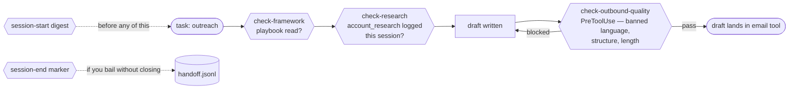

# Enforcement Hooks

Instructions in a prompt are polite suggestions. Under time pressure, Claude will skip the research, skim the framework, or reach for banned marketing vocabulary. The hooks in `hooks/` make the skip impossible.

Where the gates sit in one outbound task:



Three of these run mechanically via Claude Code's hook system (digest, end-marker, outbound gate); the rest are invoked by the protocols. The point is placement: each gate sits where skipping it would otherwise be invisible.

## The hooks

### `hooks/check-config.sh`

Fails loudly if `MY-CONFIG.md` is missing or incomplete. Runs at session start via the preamble. No work proceeds until every required field is filled.

### `hooks/check-research.sh`

Before drafting outreach, call prep, business cases, or anything account-specific, Claude must have done external research on the account within the current session. The hook scans `memory/analytics.jsonl` for a recent `account_research` event.

```bash
bash hooks/check-research.sh "ACME Bank"
```

Fails if no research exists. Enforces [Principle 1 — Research Before Everything](https://github.com/ckinkead-sayari/GTM-OSS/blob/main/ETHOS.md#1-research-before-everything).

### `hooks/check-framework.sh`

Before generating any framework-scoped content, Claude must have read the relevant framework file in the current session. Routing table lives in the script + `.claude/CLAUDE.md`:

```bash
bash hooks/check-framework.sh "outreach"
```

Returns the list of files that must be read. Claude then confirms via a `framework_used` log line in `analytics.jsonl`.

### `hooks/check-quality.sh`

Scans prospect-facing content for banned language and fluff before it ships:

- Marketing vocabulary: "seamless", "next-gen", "cutting-edge", "leverage", "comprehensive solution"
- Corporate filler: "In today's rapidly evolving landscape", "In an era of…", "It's important to note that…"
- Generic CTAs: "Schedule a demo!", "Learn more!"
- Round-number claims: "10x improvement", "99.9%" without source

```bash
echo "your draft email" | bash hooks/check-quality.sh
```

Returns a list of violations. Enforces [Principle 4 — Consultant Tone](https://github.com/ckinkead-sayari/GTM-OSS/blob/main/ETHOS.md#4-consultant-tone-not-marketing-copy).

### `hooks/session-start.sh` + `hooks/session-end.sh` (wired)

Session lifecycle hooks, wired into Claude Code via `.claude/settings.json`. SessionStart prints a preamble digest into context automatically (config, MCP staleness, git state, handoff gaps, account-file freshness, P0 age) — so a skipped preamble can no longer mean a blind session. SessionEnd leaves a marker in `memory/handoff.jsonl` when a session dies with uncommitted work, so stranded state is surfaced next session instead of weeks later.

### `hooks/check-outbound-quality.sh` (wired)

A PreToolUse gate on `*create_draft*` tools: extracts the draft text from the tool call, runs `check-quality.sh`, and **blocks the call** on violations. Banned language physically cannot reach a Gmail draft — the strongest enforcement in the system.

### `hooks/git-safe.sh` + `hooks/reap-git-locks.sh`

Infrastructure hooks, not content hooks. `git-safe.sh` is the wrapper scheduled tasks route all git ops through — it detects stale `.git/{index,HEAD,ORIG_HEAD}.lock` files, serializes concurrent writers, and exits with an actionable error on virtiofs EPERM. `reap-git-locks.sh` is the host-side launchd reaper that cleans up locks the Cowork sandbox can't unlink. Full story in [ARCHITECTURE.md → Infrastructure Postmortems](https://github.com/ckinkead-sayari/GTM-OSS/blob/main/ARCHITECTURE.md#recurring-gitindexlock-stranding-s-020--s-025-resolved).

## Soft vs. hard enforcement

Two layers:

- **Soft** (`.claude/CLAUDE.md` instructions): Claude follows the rules because the rules are written. Works in any Claude environment.
- **Hard** (shell scripts): validation steps that run mechanically. Three are wired into Claude Code's hook system today (SessionStart digest, SessionEnd marker, PreToolUse outbound gate); the rest run via the preamble and framework protocols.

Both layers required. Soft discipline alone erodes; hard enforcement alone feels punitive. Together they remove the cost of good behavior.

## Why this matters

The operating principles in [ETHOS.md](https://github.com/ckinkead-sayari/GTM-OSS/blob/main/ETHOS.md) are non-negotiable. But "non-negotiable" only holds if there's a mechanism backing it. Hooks are that mechanism.

The alternative — trusting Claude to remember every principle at the moment of content generation — doesn't survive contact with deadlines. You'll get banned language back because "just this once, it fits." You'll get cold outreach without research because "we need to move fast." You'll get a framework-less business case because "I didn't want to read the whole file."

Hooks remove "just this once" as an option.

## See also

- [The Frameworks](the-frameworks.md) — what hooks are enforcing against.
- [Reference → Hooks](../reference/hooks.md) — per-hook spec, inputs, outputs, exit codes.
- [Introduction → Why enforcement, not just instructions](../start-here/introduction.md#why-enforcement-not-just-instructions).
