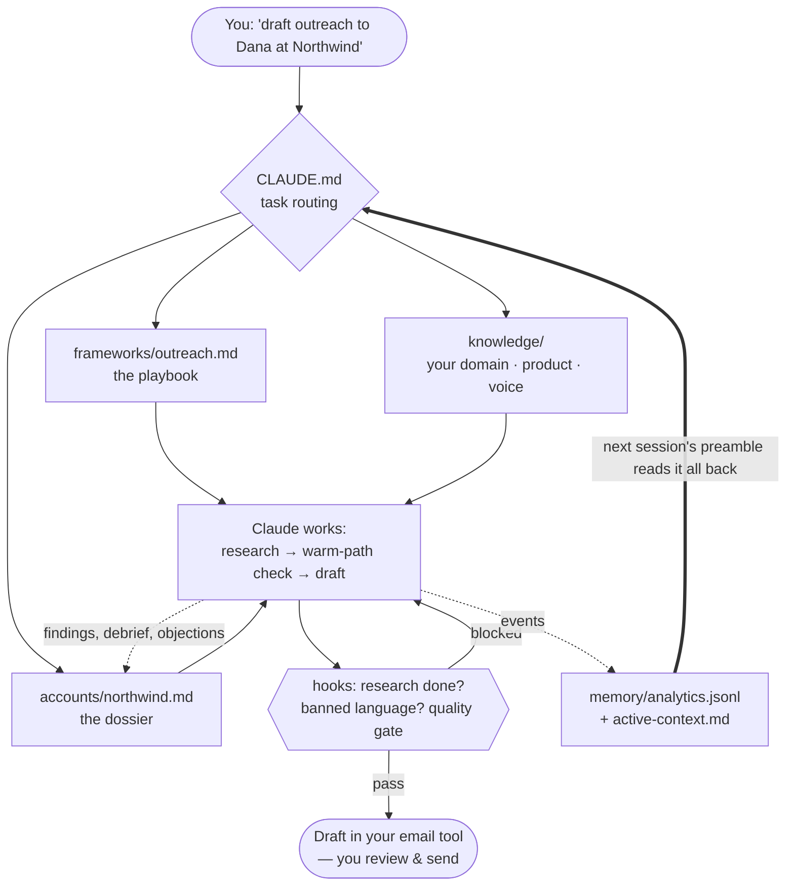
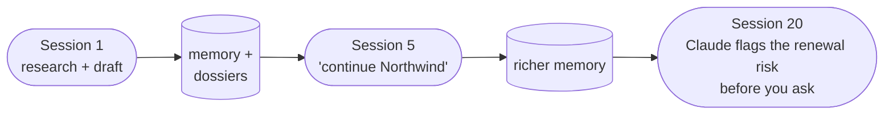

# claudeGTM

**Stop starting from zero.** Persistent context and enforced discipline for GTM work with Claude.

A forkable operating system for account managers, sellers, and CS reps doing deep-account work with Claude Code (or Cowork). Every session gets your account context, your voice, your frameworks, and your pipeline state — so each conversation picks up where the last one stopped instead of starting over.

---

## Choose your path

| You are… | Start with |
|----------|-----------|
| **New, want it working today** | [Quick Start](start-here/quick-start.md) → run `/bootstrap` → you're drafting researched, on-voice outreach within the hour |
| **Joining a team that already runs this** | [Team Adoption](start-here/team-adoption.md) — import your team's knowledge files instead of building from scratch. Day-one productivity is the whole point |
| **Want to see it before installing anything** | [An Example Session](start-here/example-session.md) — the full loop in 5 minutes of reading, including the hooks blocking bad work |
| **Evaluating / want the philosophy first** | [Introduction](start-here/introduction.md) + the Concepts section below |
| **Not an engineer, slightly terminal-averse** | Good news: [FAQ, first question](start-here/faq.md). Claude runs the commands; you bring the judgment |
| **Just want one page to send someone** | [How to Use It](start-here/how-to-use-it.md) — the overview + diagrams, evaluate-or-onboard in one read |

## How it works

One loop, four moving parts: policy routes the task, frameworks + your knowledge shape the work, hooks gate the output, and everything worth keeping is appended where the *next* session will read it.

The compounding is the product: each session leaves Claude measurably smarter about your book than it found it.

## Start Here

- **[How to Use It](start-here/how-to-use-it.md)** — the one-page overview (what it is · the loop · setup), with diagrams. Forward it to anyone.
- **[Quick Start](start-here/quick-start.md)** — private repo → `/bootstrap` → first session. ~15 minutes to running.
- **[An Example Session](start-here/example-session.md)** — watch the whole loop run, hooks and all, before you commit to anything.
- **[Team Adoption](start-here/team-adoption.md)** — onboarding the second (and tenth) person on a team.
- **[Connect Your Stack](start-here/connect-your-stack.md)** — MCP slot map, the minimum viable stack, what degrades without each tool.
- **[Customize for Your Domain](start-here/customize-for-your-domain.md)** — the manual path to the knowledge files (or just run `/bootstrap`).
- **[FAQ & Glossary](start-here/faq.md)** — data safety, costs, "I'm not technical," and every term defined.
- **[Fork Guide](start-here/fork-guide.md)** — the full setup walkthrough, staying current with upstream, troubleshooting.
- **[Introduction](start-here/introduction.md)** — the operating philosophy.

## Concepts

- **[The Preamble](concepts/the-preamble.md)** — what Claude does in the first 30 seconds of every session.
- **[The Frameworks](concepts/the-frameworks.md)** — task-to-file routing; why Claude reads before writing.
- **[Enforcement Hooks](concepts/enforcement-hooks.md)** — how discipline is enforced, not just suggested.
- **[Accretive Knowledge](concepts/accretive-knowledge.md)** — why the system gets smarter over time.

## Reference

- **[Frameworks Index](reference/frameworks.md)** — every playbook, what it does, when it fires.
- **[Knowledge Base](reference/knowledge.md)** — the institutional-knowledge files.
- **[Hooks](reference/hooks.md)** — enforcement scripts + the host-side lock reaper.
- **[Scheduled Tasks](reference/scheduled-tasks.md)** — the optional automation catalog.

## Deeper reading

- [ARCHITECTURE.md](https://github.com/ckinkead-sayari/GTM-OSS/blob/main/ARCHITECTURE.md) — full system design, file roles, infrastructure postmortems.
- [ETHOS.md](https://github.com/ckinkead-sayari/GTM-OSS/blob/main/ETHOS.md) — the operating principles in full.

---

## Audience

A single-user operating system, meant to be instantiated per person — your voice and your accounts don't average with anyone else's. Teams adopt it one private repo per rep, sharing the domain layer through [Team Adoption](start-here/team-adoption.md). Not a multi-tenant product.
