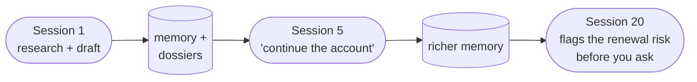
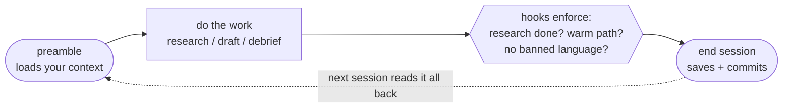
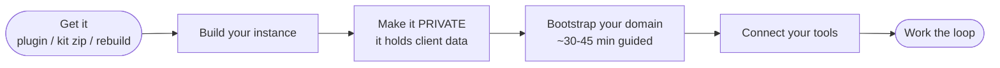

# How to Use claudeGTM

The one-page overview — what it is, how a session works, and how to get going. Forward this to anyone evaluating or onboarding. For click-by-click setup see [New User Setup](new-user-setup.md); to watch the loop run, [An Example Session](example-session.md).

## What it is

A persistent operating system for deep-account GTM work with Claude. Your account context, your voice, your frameworks, and your pipeline live in files Claude reads automatically — and a set of hooks makes the discipline (research-first, warm-before-cold, quality-gated drafts) mechanical instead of optional.

## Why it's different: context compounds

Most AI sessions start cold. claudeGTM sessions don't — each one writes back what it learned, so the system gets smarter the longer you use it.

## How a session works

Three moves, every time:

1. **Start** — *"run the preamble"*: loads your accounts, pipeline, and open actions; flags anything stale.
2. **Work** — research an account, draft outreach, debrief a call. Hooks enforce the rules: no drafting before research, warm-path-before-cold, and banned marketing language is blocked *before* it reaches a draft.
3. **End** — *"end session"*: rolls your context forward and saves it. (Skip this and the session's learning is lost.)

## Getting set up (~45 minutes)

1. **Get it** — install the `claudegtm-os` plugin, unzip the starter kit, or ask Claude to *"recreate claudeGTM from scratch"* in an empty folder.
2. **Make it private** — it holds client data within a week. Never public.
3. **Bootstrap** — ask Claude to *"bootstrap"*: a guided ~30–45 min session that writes your knowledge files (market, product, voice) and stubs your first dossiers. *Joining a team? Import their shared knowledge bundle instead and skip the rebuild — see [Team Adoption](team-adoption.md).*
4. **Connect your tools** — email + calendar to start; CRM/analytics later. See [Connect Your Stack](connect-your-stack.md).
5. **Work the loop.**

Full step-by-step: [New User Setup](new-user-setup.md).

## What ships vs. what you bring

| Ships with it | You provide (once, via bootstrap) |
| --- | --- |
| Frameworks: outreach, business case, champion doc, objections, debrief, expansion, retro | Your domain knowledge (market, regulations, competitors) |
| Enforcement hooks + session rituals | Your product truth (so Claude never overclaims) |
| The memory + dossier model | Your voice (from ~10–30 of your sent emails) |
| Optional scheduled tasks | Your accounts (built as you research) |

## The discipline it enforces

Research before outreach · warm before cold · read the framework first · quality-gate everything outbound · append don't strand · report completion status · see something say something. (Each with its *why*: `.claude/CLAUDE.md` → Non-Negotiables.)

## Day-to-day — what you actually type

- *"Research Acme Bank."* → external research lands in the dossier, not lost in chat.
- *"Draft outreach to Dana at Acme."* → forces research-first, warm-path check, your voice, the quality gate.
- *"Debrief the Acme call."* → a 7-point debrief appended to the dossier; objections logged.
- *"End session."* → everything saves and compounds.

## One rule above all

Keep your instance **private** — it accumulates client data by design. The system checks every session and warns loudly if it's ever exposed.
