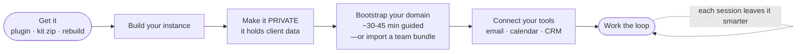
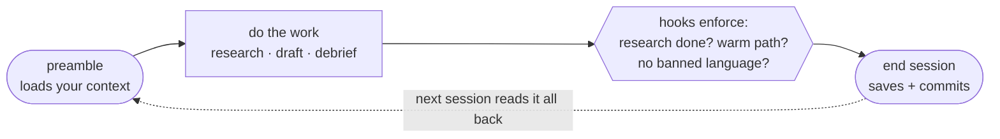

# New User Setup

Getting from zero to a working claudeGTM instance — about 45 minutes. This is the hand-holding version you can forward to anyone; if you're comfortable in a terminal, the [Quick Start](quick-start.md) is the short version.

## What you'll end up with

Your own **private** claudeGTM folder — your accounts, your voice, your pipeline — plus the rituals to run it. It gets a little smarter every session, because each session writes back what it learned.

## The setup flow

## Step by step

### 1. Get it — pick one
- **Plugin** *(if your team publishes one)*: open the plugin panel → **Local uploads** → **`+`** → choose the `claudegtm-os.plugin` file you were sent. Or `/plugin marketplace add <your-team-repo>` → `/plugin install claudegtm-os@claudegtm`.
- **Kit zip** *(simplest, no account)*: unzip the kit you were sent and open the folder in Claude Code. It already contains everything — skip to step 3.
- **Rebuild from nothing**: open an empty folder in Claude Code and ask Claude to **"recreate claudeGTM from scratch"** (the `recreate-from-scratch` skill).

### 2. Build your instance
If you used the **plugin** or **rebuild** path, ask Claude to **"recreate claudeGTM from scratch"** in an empty folder — it writes the full system (operating contract, enforcement hooks, frameworks, memory model) into that folder. (Kit-zip users already have this.)

### 3. Make it private
Within a week this folder holds client dossiers and pipeline state. Keep it private:
- **Local only:** `git init` with no remote; back it up with Time Machine or a cloud drive, **or**
- **Private repo:** create one set to **Private** — never public, and never the GitHub "Fork" button (a fork of a public repo can't be made private).

The session-start digest re-checks this every session and warns loudly if your code ever lands in a public repo.

### 4. Bootstrap your domain
Ask Claude to **"bootstrap"** (the `bootstrap` skill): a guided ~30–45 minute session. You answer questions and paste raw material; Claude researches and writes your knowledge files (your market, your product, your voice) and stubs your first account dossiers.

> **Joining a team that already runs this?** Don't rebuild — ask your team for their shared **knowledge bundle** (domain summary, product capabilities, objection catalog, call-prep). Drop those files in first; bootstrap then just *localizes* to your accounts and voice, and you're productive on day one. (See [Team Adoption](team-adoption.md).)

### 5. Connect your tools
Wire up your MCP connectors — start with just **email + calendar**, add CRM/analytics later. Bootstrap probes them and tells you what's connected. Details: [Connect Your Stack](connect-your-stack.md).

### 6. Run the loop
- **"run the preamble"** (or `/preamble`) to start a session — it loads your context and flags anything stale.
- Do the work: *"research [account]"*, *"draft outreach to [contact]"*, *"debrief the [account] call"*.
- **"end session"** to close — context rolls forward, gets saved, and (if you use a repo) committed.

## The two things that make or break it
- **Keep the repo private** — the digest warns if it ever goes public.
- **Always "end session"** — unsaved context is deleted context.

## Where to go next
[An Example Session](example-session.md) shows the whole loop running in five minutes. [Customize for Your Domain](customize-for-your-domain.md) is the manual alternative to bootstrap.
