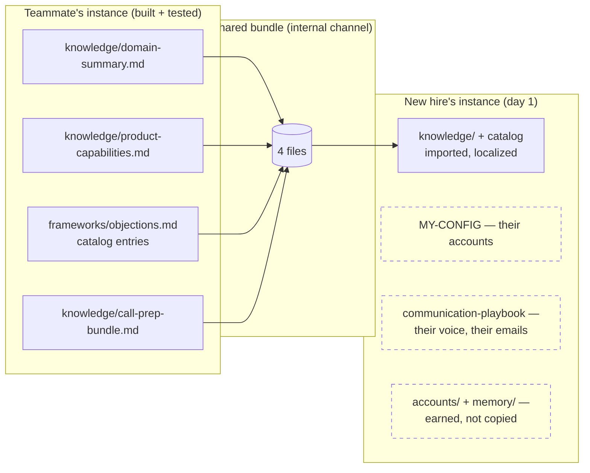

# Team Adoption — Onboarding the Second (and Tenth) Person

The system is single-user by design: one repo per seller, holding their voice, their accounts, their pipeline. But when a **new person joins a team that already runs it**, most of what `/bootstrap` would build from scratch already exists — someone on the team has battle-tested domain knowledge, product truth, and an objection catalog with real entries.

Sales-onboarding research is blunt about this: average SaaS ramp is ~5.7 months, and structured knowledge transfer is what compresses it. The new hire's scarce resource isn't intelligence — it's *encoded context*. So transfer the encoding.

## What's shareable vs. personal

| Share it | Keep it personal |
|----------|------------------|
| `knowledge/domain-summary.md` — the vertical's pains, drivers, competitors | `.claude/MY-CONFIG.md` — identity, account list, service IDs |
| `knowledge/product-capabilities.md` — product truth incl. honest gaps | `knowledge/communication-playbook.md` — voice is not transferable |
| `frameworks/objections.md` — the catalog entries are the team's scar tissue | `accounts/*.md` — dossiers belong to the relationship owner |
| `knowledge/call-prep-bundle.md` (if customized) | `memory/*` — pipeline state, analytics, handoff history |

## For the team lead (10 minutes per new hire)

1. Bundle the four shareable files from your instance.
2. Send them through an **internal** channel — Slack DM, shared drive, internal repo. Never through a public repo, gist, or anything indexable: these files are your competitive playbook.
3. Tell the new hire to mention the bundle when they run `/bootstrap`.

Worth aligning as a team while you're at it: account-file naming (it makes peer review of dossiers possible), and a periodic objection-catalog swap — the catalog compounds fastest when every rep's entries flow back into one shared version.

## For the new hire (day 1)

1. Create your private repo from the template ([Quick Start](quick-start.md) steps 1–2).
2. Drop the shared files into place **before** running `/bootstrap`.
3. Run `/bootstrap` — it detects existing knowledge files and switches from *generate* to **import-and-localize**: it validates the files, then asks what's different about YOUR patch (territory, segment, named accounts, regulatory flavor) and adjusts. Phases 1 (identity), 4 (your voice — needs YOUR sent emails, even 10 from a previous role works), 5 (your tool wiring), and 6 (your dossiers) still run in full — those were never shareable.
4. Work one real account through the loop the same day ([An Example Session](example-session.md) shows it).

**Day-one outcome:** outreach grounded in the team's tested positioning, objection responses with provenance, your own voice — instead of week three of re-deriving what the person next to you already knew.

## What NOT to do

- **Don't fork or copy a teammate's whole repo.** Their dossiers, pipeline, and analytics are confidential to their relationships — and their git history carries all of it forever.
- **Don't share the voice file.** Outreach in someone else's voice reads wrong within two emails, and the quality gate can't save you from sounding like a different human.
- **Don't skip localization.** A domain summary tuned for Tier-1 EMEA banks will quietly mislead a rep covering US regional insurers. The import step exists to catch exactly this.
